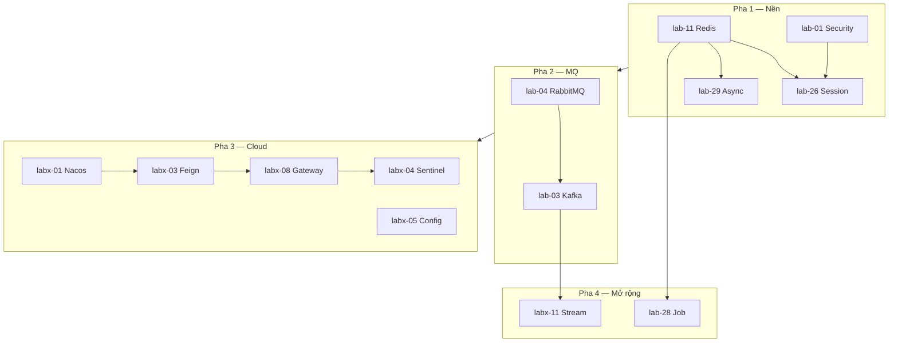

# Lộ trình học — HDL Spring Boot Labs

> Tài liệu theo dõi lộ trình học từ yudao-labs. Có thể **cập nhật / tùy chỉnh** khi nhu cầu thay đổi.
>
> **Ngày tạo:** 2026-08-18 (~14:09 UTC+7)  
> **Cập nhật lần cuối:** 2026-08-24  
> **Ước lượng tổng:** ~85–120 giờ (lộ trình tối ưu)  
> **Stack HDL:** Java 21, Spring Boot **3.x** (target **3.5**) — không copy yudao 2.x nguyên si

---

## Cách dùng tài liệu này

1. Mỗi block: đọc yudao → hỏi / review → **code lại** module tương ứng trong HDL.
2. Đánh dấu tiến độ: đổi `- [ ]` → `- [x]` khi hoàn thành.
3. Ghi chú vào cột **Ghi chú / HDL module** khi tạo module hoặc điều chỉnh.
4. Khi thay đổi lộ trình: sửa file này, cập nhật **Changelog** ở cuối.

### Trạng thái (tùy chọn)

| Ký hiệu | Ý nghĩa |
|---|---|
| `- [ ]` | Chưa bắt đầu |
| `- [x]` | Hoàn thành (đã code lại HDL + hiểu core) |
| `~` trong ghi chú | Đang làm |
| `skip` | Bỏ qua (có lý do — ghi trong ghi chú) |

### Quy trình mỗi block

```text
Đọc bài + overview yudao  →  Chạy demo (nếu cần)  →  Code lại HDL  →  Review / hỏi chỗ chưa hiểu
```

Trong lab lớn (`lab-03`, `lab-04`, `lab-11`…): chỉ **bắt buộc** submodule *demo → ack/retry → concurrency*; phần còn lại đọc overview.

---

## Mục tiêu

- Nắm **nền tảng** Spring Boot + hạ tầng thường gặp (Redis, Security, MQ, Cloud).
- Hiểu **luồng** (HTTP, message, async) và **concurrency** (thread pool, consumer song song, lock phân tán).
- Áp dụng thực tế: cache/lock, bảo vệ API, MQ reliable, microservice với Nacos + Gateway + Sentinel.

### Nguyên tắc học

- Lab yudao **độc lập về code**; phụ thuộc là **kiến thức**, không phải compile.
- Không cần học theo số thứ tự thư mục (`lab-01` → `lab-71`).
- Không code khi chưa hiểu — hỏi / nhờ review trước khi implement.
- **Yudao = nguồn học (Boot 2.x).** HDL = implement lại trên **Boot 3.5**. Concept giữ; API / package / starter có thể khác — không copy-paste `pom` và `SecurityConfig` 2.x.

---

## Tổng quan lộ trình

```text
Pha 1  Nền (1 process)     Redis → Security → Session → Async
Pha 2  Message              RabbitMQ → Kafka
Pha 3  Spring Cloud         Nacos+Feign → Config → Gateway → Sentinel
Pha 4  Mở rộng              Stream (Kafka) · Job (khi cần)
```



### Ước lượng thời gian

| Mức cam kết | Giờ/tuần | Thời gian ước lượng |
|---|---|---|
| Nhẹ | 6–8h | ~12–18 tháng |
| Vừa | 10–15h | ~6–10 tháng |
| Tập trung | 20–25h | ~4–5 tháng |

---

## Stack khi code lại (HDL)

| | Yudao-labs (đọc) | HDL labs (viết lại) |
|---|---|---|
| Java | 8 | **21** |
| Spring Boot | **2.2.x** | **3.5.x** (3.x, không dùng 2.x) |
| Spring Cloud | Hoxton | tương thích Boot 3.5 (vd. **2025.0.x**) |
| Spring Cloud Alibaba | 2.2.x | bản tương thích Boot 3.x / Cloud 2025 |

Học **mô hình** từ yudao; khi implement, tra doc Boot 3 / Cloud 2025. Các chỗ lệch API hay gặp:

| Chủ đề | Boot 2 (yudao) | Boot 3.5 (HDL) |
|---|---|---|
| Package | `javax.*` | `jakarta.*` |
| Security | `WebSecurityConfigurerAdapter` | `SecurityFilterChain` bean, `HttpSecurity` lambda |
| Redis client | Jedis thường thấy trong demo | Lettuce **default**; Jedis vẫn dùng được nếu chọn |
| Load balancer | Ribbon (`labx-02`, không học sớm) | `spring-cloud-starter-loadbalancer` |
| Config bootstrap | `bootstrap.yml` phổ biến | optional; ưu tiên `application.yml` + `spring.config.import` |
| Feign | `spring-cloud-starter-openfeign` | vẫn OpenFeign; artifact/BOM theo Cloud 2025 |
| Nacos / Sentinel | starter Alibaba 2.2 | starter Alibaba **tương thích Boot 3** — kiểm tra compatibility matrix trước khi thêm dependency |

Khi review code HDL: ưu tiên API 3.5, không “dịch nguyên văn” class 2.x nếu đã deprecated.

---

## Pha 1 — Nền trong một process

**Kết quả pha:** App biết cache/lock, bảo vệ API, session đa instance, async không block request.

| # | Trạng thái | Lab yudao | Submodule / gợi ý đọc | Giờ ước lượng | Kiến thức chính | Ghi chú / HDL module |
|---|---|---|---|---|---|---|
| 1 | - [x] | `lab-11-spring-data-redis` | Jedis hoặc Redisson submodule; lock, rate limit test | 10–15h | Template, serialize, cache object, **distributed lock**, rate limit, pub/sub, pipeline, Lua | HDL: `with-lettuce` (RedisTemplate, Jackson, Lua CAS, Pub/Sub) + `with-redisson` (RLock, RRateLimiter). Pipeline: đọc overview, skip code lại. |
| 2 | - [x] | `lab-01-spring-security` | `springsecurity-demo` + `demo-role` | 10–15h | Filter chain, login, **RBAC**, bảo vệ endpoint | HDL: `demo` (auto-config) + `demo-role` (`SecurityFilterChain`, BCrypt, URL + `@PreAuthorize`, `@EnableMethodSecurity`). Session/form login — JWT để cuối lộ trình. Ghi chú: `lab-01-spring-security/Spring Security.md` |
| 3 | - [x] | `lab-26` | `distributed-session-01` hoặc `springsecurity` | 6–10h | Session Redis, scale nhiều instance | HDL: `lab-26-distributed-session-redis` + `...-springsecurity`. Skip Mongo + indexed `/list`. Ghi chú: `lab-26-distributed-session/Spring Session.md` |
| 4 | - [x] | `lab-29` | `async-demo` + `async-two` (thread pool riêng) | 6–10h | `@Async`, thread pool, exception async | HDL: `lab-29-async-basic` + `lab-29-async-multi-executor`. `CompletableFuture` (không AsyncResult). Multi-executor: bean tay. Ghi chú: `lab-29-async/Spring Async.md` |

**Bài viết tham chiếu (trong repo yudao):**

- `lab-11-spring-data-redis/《芋道 Spring Boot Redis 入门》.md`
- `lab-01-spring-security/《芋道 Spring Boot 安全框架 Spring Security 入门》.md`
- `lab-26/《芋道 Spring Boot 分布式 Session 入门》.md`
- `lab-29/《芋道 Spring Boot 异步任务入门》.md`

---

## Pha 2 — Message (luồng + concurrency)

**Kết quả pha:** Reliable messaging, retry, consumer song song, hiểu order vs throughput.

| # | Trạng thái | Lab yudao | Submodule tối thiểu | Giờ ước lượng | Kiến thức chính | Ghi chú / HDL module |
|---|---|---|---|---|---|---|
| 5 | - [x] | `lab-04-rabbitmq` | `demo` → `ack` → `consume-retry` → `concurrency` → `orderly` | 15–25h | Exchange/queue, ack, DLQ/retry, nhiều consumer, **thứ tự vs song song** | **5/5 bắt buộc xong.** Note: `Spring RabbitMQ.md`. Bổ sung publisher confirm: xem mục dưới. |
| 6 | - [x] | `lab-03-kafka` | `demo` → `ack` → `concurrency` → `batch` | 15–25h | Topic/partition, consumer group, offset, scale partition, batch | **4/4 bắt buộc xong.** Note: `Spring Kafka.md` §9. **Pha 2 bắt buộc xong.** Tiếp mặc định: Pha 3. |

**Thứ tự:** Rabbit trước (queue dễ hình dung) → Kafka (partition, log).

### Bổ sung MQ (không đếm vào 12 block / % tiến độ)

Sau khi **bắt buộc** Pha 2 xong; **không** chặn Pha 3. Làm khi cần độ tin cậy phía **gửi** Rabbit, hoặc nghỉ giữa Cloud.

| Trạng thái | Yudao → HDL (chưa port) | Khi nào | Học gì |
|---|---|---|---|
| - [ ] | `demo-confirm` → HDL `…-confirm` | Slot bổ sung | `publisher-confirm-type: simple` |
| - [ ] | `demo-confirm-async` → HDL `…-confirm-async` | **Ưu tiên hơn** `confirm` nếu chỉ làm 1 | `correlated` + `ConfirmCallback` / Returns |
| overview | `rpc`, `transaction`, `delay`, `batch-consume`… | Khi job cần | Đọc note skip; code lại từng cái |

**Kafka:** “đã vào broker?” ≈ `KafkaTemplate.send` + `whenComplete` / `.get()` + `acks` (đã có ở `lab-03`) — không cần lab confirm riêng.

**Gợi ý lịch:** mặc định → Pha 3 ngay; chèn confirm(-async) giữa/sau Pha 3 hoặc khi stack công ty dùng Rabbit nặng phía publish.

**Bài viết tham chiếu:**

- `lab-04-rabbitmq/《芋道 Spring Boot 消息队列 RabbitMQ 入门》.md`
- `lab-03-kafka/《芋道 Spring Boot 消息队列 Kafka 入门》.md`
- HDL note: `lab-04-rabbitmq/Spring RabbitMQ.md`, `lab-03-kafka/Spring Kafka.md`

---

## Pha 3 — Spring Cloud

**Kết quả pha:** Multi-service, config tập trung, gateway, flow control. Dùng **Spring Cloud** + **Spring Cloud Alibaba** (Nacos, Sentinel).

| # | Trạng thái | Lab yudao | Gợi ý | Giờ ước lượng | Kiến thức chính | Ghi chú / HDL module |
|---|---|---|---|---|---|---|
| 7 | - [ ] | `labx-01` + `labx-03` | Nacos discovery + OpenFeign (gộp 1 mini system) | 12–18h | Service registry, gọi theo service name, load balance, Feign | |
| 8 | - [ ] | `labx-05` | Nacos Config | 6–10h | Config external, namespace/group, refresh | |
| 9 | - [ ] | `labx-08` | Gateway demo cơ bản + route/filter | 12–18h | Spring Cloud Gateway, routing, filter | |
| 10 | - [ ] | `labx-04` | Sentinel provider | 8–12h | QPS/thread limit, circuit break, degrade | Sau Gateway |

**Lưu ý version:** yudao = Boot 2.2 + Cloud Hoxton + Alibaba 2.2. HDL = **Boot 3.5 + Cloud 2025 + Alibaba tương thích Boot 3**. Concept (discovery, config, gateway, Feign, Sentinel) giữ; starter và YAML khác — đối chiếu compatibility trước khi copy `pom`.

**Bài viết tham chiếu:**

- `labx-01-spring-cloud-alibaba-nacos-discovery/《芋道 Spring Cloud Alibaba 注册中心 Nacos 入门》.md`
- `labx-03-spring-cloud-feign` (README Spring Cloud 专栏)
- `labx-05-spring-cloud-alibaba-nacos-config/《芋道 Spring Cloud Alibaba 配置中心 Nacos 入门》.md`
- `labx-08-spring-cloud-gateway/《芋道 Spring Cloud 网关 Spring Cloud Gateway 入门》.md`
- `labx-04-spring-cloud-alibaba-sentinel/《芋道 Spring Cloud Alibaba 服务容错 Sentinel 入门》.md`

---

## Pha 4 — Mở rộng (tùy nhu cầu)

| # | Trạng thái | Lab yudao | Điều kiện | Giờ ước lượng | Kiến thức chính | Ghi chú / HDL module |
|---|---|---|---|---|---|---|
| 11 | - [ ] | `labx-11` Stream Kafka | Sau `lab-03` | 10–15h | Spring Cloud Stream, binder, concurrency trên abstraction | Có thể skip nếu đã vững Kafka client |
| 12 | - [ ] | `lab-28` Job | Sau Redis (lock) | 8–12h | `@Scheduled`, Quartz / XXL-JOB, job đa instance | |

---

## Bản đồ capability → lab

| Capability | Lab | Pha |
|---|---|---|
| Cache / lock / rate limit | `lab-11` | 1 |
| AuthN / AuthZ API | `lab-01` | 1 |
| Session đa instance | `lab-26` | 1 |
| Thread pool / async trong app | `lab-29` | 1 |
| Work queue, retry, DLQ | `lab-04` (bắt buộc) | 2 |
| Publisher confirm (Rabbit gửi) | `lab-04` confirm / confirm-async — **bổ sung**, không đếm block | 2* |
| Event log, partition, consumer group | `lab-03` | 2 |
| Service discovery + gọi service | `labx-01` + `labx-03` | 3 |
| Config center | `labx-05` | 3 |
| API gateway | `labx-08` | 3 |
| Flow control / circuit break | `labx-04` | 3 |
| MQ qua Spring Cloud Stream | `labx-11` | 4 |
| Scheduled / distributed job | `lab-28` | 4 |

---

## Phụ thuộc kiến thức (nên tôn trọng)

| Trước | Sau | Lý do |
|---|---|---|
| `lab-11` Redis | `lab-26`, lock trong job, rate limit | Redis là hạ tầng chung |
| `lab-01` Security | `lab-26` | Session + auth |
| `lab-04` / `lab-03` client | `labx-11` Stream | Stream là abstraction trên broker |
| 1 app + MQ cơ bản | `labx-01` Nacos | Cloud = nhiều service |
| Nacos + Feign | Gateway, Sentinel | Route theo service name; limit traffic |
| `lab-29` Async | Consumer MQ (tùy chọn) | Cùng mô hình thread pool |

**Làm song song được:** Redis ↔ Security (trước session); Rabbit ↔ Kafka (nếu đã quen 1 MQ).

---

## Không trong lộ trình tối ưu (học sau)

| Lab / chủ đề | Lý do để sau |
|---|---|
| Eureka, Ribbon, Hystrix, Zuul (`labx-02`, `22`, `23`, `21`) | Legacy, deprecated |
| OAuth `lab-02`, `lab-68` | Sau Security vững |
| JWT monolith (stateless REST) | Không có lab yudao sạch; thêm cuối lộ trình sau `lab-26` / Pha 2 — xem ghi chú `lab-01/.../Spring Security.md` |
| WebFlux `lab-27`, benchmark `lab-05/06` | Không chặn microservice |
| RocketMQ Stream `labx-06` | Nếu không dùng RocketMQ |
| Seata `labx-17`, SkyWalking `labx-14`, Apollo `labx-09` | Nâng cao / theo công việc |
| Submodule actuator, aliyun, transaction… | Đọc overview, không code lại lần đầu |
| Rabbit `confirm` / `confirm-async` (và rpc/delay…) | **Không** bỏ hẳn — slot bổ sung Pha 2 (mục trên); không đếm vào 12 block |

---

## Theo dõi tiến độ nhanh

| Pha | Blocks | Hoàn thành | % |
|---|---|---|---|
| Pha 1 | 4 | 4 / 4 | 100% |
| Pha 2 | 2 | 2 / 2 | 100% |
| Pha 3 | 4 | 0 / 4 | 0% |
| Pha 4 | 2 | 0 / 2 | 0% |
| **Tổng** | **12** | **6 / 12** | **50%** |

> Cập nhật bảng trên khi đánh dấu checkbox.

---

## Ghi chú cá nhân

<!-- Ghi deadline, điều chỉnh giờ/tuần, link module HDL, bài học rút ra... -->

- **Giờ học/tuần dự kiến:**
- **MQ ưu tiên công ty:** Rabbit / Kafka / cả hai
- **Target stack HDL:** Java 21, Spring Boot **3.5.x**, Spring Cloud **2025.0.x** (khớp Boot 3.5)

---

## Hướng dẫn tùy chỉnh lộ trình

1. **Thêm block:** copy một dòng trong bảng pha, đánh số mới, ghi vào Changelog.
2. **Bỏ block:** đánh `skip` trong ghi chú, không xóa hàng (giữ lịch sử).
3. **Đổi thứ tự:** chỉ đổi khi không vi phạm bảng phụ thuộc; ghi lý do trong Changelog.
4. **Thêm pha 5 (nâng cao):** OAuth, Seata, observability — tạo section mới cuối file.
5. **Đồng bộ % tiến độ:** đếm checkbox `- [x]` trong các bảng pha.

---

## Changelog

| Ngày | Thay đổi |
|---|---|
| 2026-08-18 | Tạo lộ trình tối ưu 12 block (4 pha), ước lượng 85–120h |
| 2026-08-18 | Chốt stack HDL: Java 21, Spring Boot **3.5** (không 2.x); thêm mục lệch API khi đọc yudao 2.x |
| 2026-08-19 | Hoàn thành `lab-11` Redis (with-lettuce + with-redisson). Bắt đầu `lab-01` Security. |
| 2026-08-20 | Hoàn thành `lab-01` Security (`demo` + `demo-role`). JWT để cuối lộ trình. Tiếp theo: `lab-26` Session. |
| 2026-08-20 | Hoàn thành `lab-26` Session Redis (`redis` + `springsecurity`). Tiếp theo: `lab-29` Async. |
| 2026-08-21 | Hoàn thành `lab-29` Async (`basic` + `multi-executor`). **Pha 1 xong.** Tiếp theo: Pha 2 `lab-04` RabbitMQ. |
| 2026-08-21 | Thêm `docs/phase-1-summary.md` — tổng kết Pha 1. |
| 2026-08-22 | `lab-04` demo xong (4 exchange + JSON). Thêm `lab-04-rabbitmq/Spring RabbitMQ.md`. Tiếp: ack. |
| 2026-08-22 | `lab-04` ack xong (manual ack, Unacked/Ready). Cập nhật `Spring RabbitMQ.md`. Tiếp: consume-retry. |
| 2026-08-22 | `lab-04` consume-retry xong (listener retry + DLQ). Cập nhật `Spring RabbitMQ.md`. Tiếp: concurrency. |
| 2026-08-22 | `lab-04` concurrency xong (simple container, multi-thread). Cập nhật `Spring RabbitMQ.md`. Tiếp: orderly. |
| 2026-08-22 | `lab-04` orderly xong (shard queue, order theo entity). **Lab-04 bắt buộc xong.** Cập nhật `Spring RabbitMQ.md`. Tiếp: `lab-03` Kafka. |
| 2026-08-23 | `lab-03` demo xong (sync/async, 2 group, retry+DLT, `application-prod.yml`). Thêm `lab-03-kafka/Spring Kafka.md`. Tiếp: `ack`. |
| 2026-08-24 | `lab-03` ack xong (MANUAL + `%2`). Ghi §2.1 theo Spring `Acknowledgment` docs. Thêm `AGENTS.md` §0.4 + `.cursor/rules/evidence-first-explanations.mdc` (cấm suy diễn giả làm chắc). Tiếp: `concurrency`. |
| 2026-08-24 | Bổ sung đầy đủ `Spring Kafka.md` §2.1 (module ack: yaml, log, docs, so Rabbit). `AGENTS.md`: bắt buộc cập nhật note lab trước khi đề xuất submodule kế. |
| 2026-08-24 | `lab-03` concurrency xong (`concurrency=2`, sticky null-key, orderly/key, topic 2 partition). Cập nhật `Spring Kafka.md` §8 + learning-path **3/4**. Tiếp: `batch`. |
| 2026-08-24 | `lab-03` batch xong (producer `linger.ms`/`batch.size`, topic `DEMO_05`, log ~+30s rồi 3 ack cùng lúc). Cập nhật `Spring Kafka.md` §9. **Lab-03 + Pha 2 xong.** Tiếp: Pha 3 Nacos + Feign. |
| 2026-08-24 | Ghi slot **bổ sung MQ**: Rabbit `confirm` / `confirm-async` (sau Pha 2 bắt buộc; không đếm 12 block; không chặn Pha 3). |
| 2026-08-24 | Header: thêm **Ngày tạo** 2026-08-18; **Cập nhật lần cuối** → 2026-08-24. |
