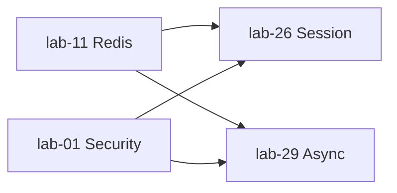

# Pha 1 — Tổng kết: Nền trong một process

> Hoàn thành: 2026-08-21  
> Stack: Java 21, Spring Boot **3.5.x**  
> Nguồn học: yudao-labs (Boot 2.x) → code lại HDL, không copy API deprecated.

---

## 1. Pha 1 là gì?

**Phạm vi:** mọi thứ chạy chủ yếu trong **một JVM / một app process** (có thể nhiều instance, nhưng chưa microservice + service discovery).

```text
Pha 1  Nền (1 process)     Redis → Security → Session → Async   ✅
Pha 2  Message              RabbitMQ → Kafka                     ✅ (2026-08-24)
Pha 3  Spring Cloud         Nacos · Feign · Gateway · Sentinel   ← tiếp theo
Pha 4  Mở rộng              Stream · Job
```

**Kết quả pha (theo lộ trình):**  
App biết cache/lock, bảo vệ API, session đa instance, async không block request.

---

## 2. Bốn block đã xong

| # | Lab | HDL modules | Ghi chú chi tiết |
|---|---|---|---|
| 1 | Redis | `with-lettuce`, `with-redisson` | [Spring Boot Redis.md](../lab-11-spring-data-redis/Spring%20Boot%20Redis.md) |
| 2 | Security | `springsecurity-demo`, `demo-role` | [Spring Security.md](../lab-01-spring-security/Spring%20Security.md) |
| 3 | Session | `distributed-session-redis`, `...-springsecurity` | [Spring Session.md](../lab-26-distributed-session/Spring%20Session.md) |
| 4 | Async | `async-basic`, `async-multi-executor` | [Spring Async.md](../lab-29-async/Spring%20Async.md) |

Thứ tự học thực tế: **11 → 01 → 26 → 29** (không theo số thư mục yudao).



- Session cần **Redis + Security** (store + auth trong session).  
- Async độc lập hơn; nối với Redis chủ yếu ở mức “cùng tư duy concurrency / pool”.

---

## 3. Từng lab — một câu + đã chứng minh gì

### lab-11 Redis

**Một câu:** Redis là store dùng chung (cache, lock, rate limit, pub/sub); Lettuce = client mặc định Boot 3; Redisson = API cao hơn (lock/rate limiter).

**Đã làm:** `RedisTemplate` + Jackson, cache object, Lua CAS, Pub/Sub, `RLock`, `RRateLimiter`.  
**Skip:** Pipeline (đọc overview), Mongo không liên quan.

### lab-01 Security

**Một câu:** Filter chain trước controller — AuthN (ai) + AuthZ (được làm gì); Boot 3 dùng `SecurityFilterChain`, không còn `WebSecurityConfigurerAdapter`.

**Đã làm:** Auto-config demo; RBAC URL + `@PreAuthorize` + `@EnableMethodSecurity`; form login + session (không JWT).  
**Nhớ:** thiếu `@EnableMethodSecurity` → annotation quyền không chạy; `hasRole("ADMIN")` không viết thêm `ROLE_`.

### lab-26 Session

**Một câu:** Cookie chỉ mang session id; nội dung session (kể cả `SPRING_SECURITY_CONTEXT`) nằm Redis → nhiều instance không cần sticky session cho login.

**Đã làm:** set/get `HttpSession` trên Redis; Security + session Redis; restart vẫn giữ attribute / login.  
**Skip:** Mongo session, indexed `FindByIndexNameSessionRepository` (Boot 3 default không có bean đó).  
**Nhớ:** `RedisSerializer.string()` không dùng cho Spring Session; đổi JSON ↔ JDK phải xóa key Redis + cookie.

### lab-29 Async

**Một câu:** `@Async` = giao việc cho thread pool trong cùng process; không block caller; nhiều pool tách loại việc.

**Đã làm:** sync vs async vs `CompletableFuture`; exception handler; hai `ThreadPoolTaskExecutor`.  
**Boot 3:** `@Async` chỉ `void` hoặc Future-like (không return `Integer`); dùng `CompletableFuture` thay `AsyncResult`/`ListenableFuture`.

---

## 4. Bản đồ khái niệm Pha 1

| Nhu cầu | Công cụ đã học |
|---|---|
| Cache / key-value | `RedisTemplate`, serializer |
| Atomic CAS | Lua script |
| Báo hiệu realtime (không persist) | Redis Pub/Sub |
| Mutex phân tán | Redisson `RLock` |
| Giới hạn tần suất | `RRateLimiter` (khác login fail counter `INCR`) |
| Bảo vệ HTTP | Spring Security filter chain + role |
| Login web stateful | Form login + HTTP Session |
| Session nhiều pod | Spring Session → Redis |
| Việc nền trong app | `@Async` + `TaskExecutor` |

### Concurrency — ba tầng (để không lẫn)

```text
Distributed     Redis lock, (sau) MQ consumer     ← lab-11 một phần; Pha 2
Spring app      @Async, Session Redis, Security  ← phần lớn Pha 1
Java SE         Thread, Executor, Future         ← ẩn dưới @Async / pool
```

`@Async` ≠ message queue: async = nhiều thread **một process**; MQ = truyền việc qua **broker**.

---

## 5. Chủ đề cố ý để sau (không thuộc “xong Pha 1”)

| Chủ đề | Khi nào |
|---|---|
| JWT / REST stateless | Cuối lộ trình (overview `lab-68`; HDL module riêng) |
| OAuth2 | Sau Security vững |
| Redis Pipeline / MULTI sâu | Overview; không chặn Pha 2 |
| Spring Session indexed / header session id | Optional |
| `@Async` + SecurityContext / transaction | Đọc khi gặp production |
| `@Scheduled` / XXL-JOB | Pha 4 `lab-28` |

---

## 6. Bài học cách học (Pha 1)

1. **Yudao = concept; HDL = Boot 3.5** — `javax`→`jakarta`, `spring.redis`→`spring.data.redis`, Security adapter → `SecurityFilterChain`.  
2. Lab lớn chỉ code submodule **bắt buộc**; còn lại overview.  
3. Review sớm các “enable” ẩn (`@EnableMethodSecurity`, serializer session, return type `@Async`).  
4. Mỗi lab có note riêng trong thư mục lab + tiến độ trong [learning-path.md](./learning-path.md).

---

## 7. Checklist “đã xong Pha 1?”

Tự trả lời được:

- [ ] Cache object Redis + vì sao cần Jackson trên classpath  
- [ ] `RLock` tryLock + unlock đúng thread / lease vs watchdog  
- [ ] Filter chain + URL vs method security  
- [ ] Session Redis: cookie mang gì, SecurityContext nằm đâu  
- [ ] `@Async` void vs `CompletableFuture`; hai executor để làm gì  
- [ ] Phân biệt async trong process vs (sắp học) MQ  

---

## 8. Tiếp theo — Pha 3 (Pha 2 đã xong)

**Pha 2 Message:** RabbitMQ → Kafka — **xong** (xem `learning-path.md`).

**Pha 3:** Nacos discovery + OpenFeign → Config → Gateway → Sentinel.

Khi bắt đầu: overview `labx-01` / `labx-03`; đối chiếu Cloud version khớp Boot **3.5** (không copy Hoxton / Boot 2.x).
