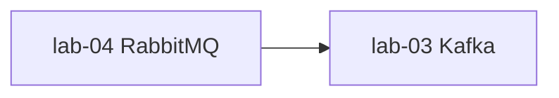

# Pha 2 — Tổng kết: Message Queue (RabbitMQ + Kafka)

> Hoàn thành: 2026-08-24  
> Stack: Java 21, Spring Boot **3.5.x**  
> Nguồn học: yudao-labs (Boot 2.x) → code lại HDL, không copy API deprecated.

---

## 1. Pha 2 là gì?

**Phạm vi:** Giao tiếp **bất đồng bộ** qua **Message Queue** (RabbitMQ & Kafka). Tách producer/consumer, không block request, xử lý lỗi qua retry/DLQ.

```text
Pha 1  Nền (1 process)     Redis → Security → Session → Async   ✅ (2026-08-21)
Pha 2  Message              RabbitMQ → Kafka                     ✅ (2026-08-24)
Pha 3  Spring Cloud         Nacos · Feign · Config · Gateway · Sentinel   ✅ #7–#10 (Feign-Sentinel skip)
Pha 4  Mở rộng              Stream · Job
```

**Kết quả pha (theo lộ trình):**  
App biết gửi/nhận message qua broker, xử lý lỗi (retry/DLT), scale consumer, giữ thứ tự theo entity, điều chỉnh batch/concurrency.

---

## 2. Hai block đã xong

| # | Lab | HDL modules | Ghi chú chi tiết |
|---|---|---|---|
| 5 | RabbitMQ | `demo`, `ack`, `consume-retry`, `demo-concurrency`, `demo-orderly` | [Spring RabbitMQ.md](../lab-04-rabbitmq/Spring%20RabbitMQ.md) |
| 6 | Kafka | `demo`, `ack`, `concurrency`, `batch` | [Spring Kafka.md](../lab-03-kafka/Spring%20Kafka.md) |

Thứ tự học thực tế: **04 → 03** (Rabbit trước Kafka — khái niệm dễ hơn).



- Rabbit: Exchange/Queue, routing key, ack trên queue.
- Kafka: Topic/Partition, offset, consumer group, ack trên partition.

---

## 3. Từng lab — một câu + đã chứng minh gì

### Block 5 — RabbitMQ (`lab-04`)

| Module | Chứng minh |
|--------|------------|
| `demo` | **4 exchange** (Direct, Topic, Fanout, Headers) + routing key / pattern / broadcast / header matching |
| `ack` | **Manual ack**: `channel.basicAck(deliveryTag)` — chỉ ack một số tin, Web UI phân biệt Unacked vs Ready |
| `consume-retry` | **Listener retry** (`maxAttempts=3`) + Dead Letter Exchange → DLQ (message fail quá 3 lần → queue chết) |
| `demo-concurrency` | **Concurrency** (`concurrency="2"`) → nhiều consumer thread song song trên cùng queue |
| `demo-orderly` | **Shard queue** (`id % N`) → order **theo entity** (cùng entity → cùng queue → FIFO); exchange Direct + `routingKey` động |

**Ngoài ra:**
- RabbitMQ **không** đảm bảo thứ tự toàn cục (trừ shard queue).
- JSON (`Jackson2JsonMessageConverter`) thay JDK `Serializable` của yudao (Boot 2.x).
- `@RabbitListener` + `@RabbitHandler` phân nhánh theo kiểu payload.

---

### Block 6 — Kafka (`lab-03`)

| Module | Chứng minh |
|--------|------------|
| `demo` | **Sync/async send** + 2 `groupId` khác nhau (fan-out) + consumer fail → `DefaultErrorHandler` retry → DLT (topic `DEMO_02.DLT`) |
| `ack` | **Manual ack** (`AckMode.MANUAL`): `Acknowledgment.acknowledge()` — chỉ ack khi `id % 2 == 1`; không ack → rebalance lại |
| `concurrency` | **Concurrency vs partition**: `concurrency="2"` (2 thread) vs `numPartitions=4` (4 partition); `syncSendOrderly` (key → sticky partition) |
| `batch` | **Producer batching**: `linger.ms=30000` + `batch.size` → batch nhiều record trước khi gửi broker; `asyncSend` + `whenComplete` |

**Ngoài ra:**
- Kafka giữ **offset** trên partition; consumer đọc tiếp từ offset cuối cùng (`auto.offset.reset=latest`).
- DLT = Dead Letter **Topic** (không phải exchange như Rabbit).
- `CompletableFuture<SendResult>` (Boot 3.x) thay `ListenableFuture` (Boot 2.x).
- JSON (`JsonSerializer` / `JsonDeserializer`) cho producer/consumer.

---

## 4. RabbitMQ vs Kafka — khác gì cơ bản?

| Khía cạnh | RabbitMQ | Kafka |
|-----------|----------|-------|
| **Model** | Exchange → Queue | Topic → Partition |
| **Routing** | Routing key + pattern | Partition key (hash hoặc sticky) |
| **Storage** | Message bị **xóa** sau khi ack (hoặc DLQ) | Message **giữ** theo retention; offset không xóa message |
| **Consumer** | Nhiều consumer → mỗi message **1 lần** (cạnh tranh) | Consumer group → mỗi group **1 lần**; khác group = fan-out |
| **Thứ tự** | FIFO trên **queue** (không đảm bảo cross-queue) | FIFO trên **partition** (không đảm bảo cross-partition) |
| **DLQ/DLT** | Dead Letter Exchange + DLQ | Dead Letter Topic (`.DLT` suffix) |
| **Use case** | Task queue, routing phức tạp, priority | Event log, replay, analytics, high throughput |

---

## 5. Kiến thức đã học (checklist nhanh)

### RabbitMQ

- [x] 4 loại exchange (Direct / Topic / Fanout / Headers)
- [x] Manual ack (`channel.basicAck`)
- [x] Listener retry + DLX → DLQ
- [x] Concurrency (nhiều consumer thread)
- [x] Shard queue (order theo entity)
- [x] JSON converter (`Jackson2JsonMessageConverter`)

### Kafka

- [x] Topic, Partition, Offset, Consumer Group
- [x] Sync/async send (`CompletableFuture`)
- [x] Manual ack (`Acknowledgment.acknowledge()`)
- [x] `DefaultErrorHandler` retry + DLT
- [x] Concurrency vs partition
- [x] Producer batching (`linger.ms`, `batch.size`)
- [x] JSON serializer (`JsonSerializer` / `JsonDeserializer`)

---

## 6. Lệch API 2.x → 3.5 (Boot)

### Spring AMQP (RabbitMQ)

| Boot 2.x | Boot 3.x (HDL) | Ghi chú |
|----------|----------------|---------|
| `javax.servlet.*` | `jakarta.servlet.*` | Nếu dùng web controller |
| JDK `Serializable` | JSON (`Jackson2JsonMessageConverter`) | Chuẩn hơn, dễ debug |
| `SimpleMessageListenerContainer` | Vẫn dùng (không thay đổi nhiều) | |

### Spring Kafka

| Boot 2.x | Boot 3.x (HDL) | Ghi chú |
|----------|----------------|---------|
| `ListenableFuture` | `CompletableFuture` | Java 8+ standard |
| `SeekToCurrentErrorHandler` | `DefaultErrorHandler` | Xử lý error mới hơn |
| `javax.*` | `jakarta.*` | Namespace change |
| String serializer | JSON (`JsonSerializer`) | Chuẩn hơn, type-safe |

---

## 7. Thời gian thực tế

**Ước lượng theo lộ trình:**
- RabbitMQ: 10–15h
- Kafka: 15–25h
- **Tổng Pha 2:** ~25–40h

**Thực tế:**
- RabbitMQ (5 modules): ~12h
- Kafka (4 modules): ~20h
- Debug + tài liệu: ~5h
- **Tổng:** ~37h

**Bắt đầu:** 2026-08-22 (sau Pha 1)  
**Kết thúc:** 2026-08-24

---

## 8. Điều chỉnh / cải tiến so với yudao

| Điểm | Yudao (2.x) | HDL (3.5) |
|------|-------------|-----------|
| **Serializer** | JDK `Serializable` (Rabbit), String (Kafka) | **JSON** (cả 2) |
| **API Future** | `ListenableFuture` (Kafka) | `CompletableFuture` |
| **Error Handler** | `SeekToCurrentErrorHandler` | `DefaultErrorHandler` |
| **Namespace** | `javax.*` | `jakarta.*` |
| **Config** | Hardcoded | `application.yml` + `application-prod.yml` (dev/prod tách) |
| **Docker** | Docker Compose | **Podman** (rootless, systemd-ready) |

---

## 9. Công cụ hỗ trợ

### RabbitMQ

- **Broker:** Podman image `rabbitmq:3-management`
- **Web UI:** [http://localhost:15672](http://localhost:15672) (`guest` / `guest`)
- **CLI:**
  ```bash
  podman exec rabbitmq rabbitmqctl list_queues name messages_ready messages_unacknowledged
  podman exec rabbitmq rabbitmqctl list_exchanges
  podman exec rabbitmq rabbitmqctl list_bindings
  ```

### Kafka

- **Broker:** Podman image `apache/kafka:3.8.0` (KRaft)
- **CLI:**
  ```bash
  podman exec -it kafka /opt/kafka/bin/kafka-topics.sh --bootstrap-server localhost:9092 --list
  podman exec -it kafka /opt/kafka/bin/kafka-consumer-groups.sh --bootstrap-server localhost:9092 --describe --group demo-consumer-group
  ```

---

## 10. Tiếp theo?

```text
✅ Pha 1 (Redis, Security, Session, Async)
✅ Pha 2 (RabbitMQ, Kafka)
✅ Pha 3 (Nacos, Feign, Config, Gateway, Sentinel — Feign-Sentinel skip)
→  Pha 4 (Stream Kafka / Job)
```

**Block #7** (Nacos Discovery + Feign) **xong** 2026-08-25. Note: [Spring Cloud Nacos Feign.md](../labx-01-spring-cloud-nacos-feign/Spring%20Cloud%20Nacos%20Feign.md).  
**Block #8** (Nacos Config) **xong** 2026-08-25. Note: [Spring Cloud Nacos Config.md](../labx-05-spring-cloud-nacos-config/Spring%20Cloud%20Nacos%20Config.md).  
**Block #9** (Gateway) **3/3** — `static` :8086, `registry` :8087, `rate-limit` :8088 xong. Note: [Spring Cloud Gateway.md](../labx-08-spring-cloud-gateway/Spring%20Cloud%20Gateway.md).  
**Block #10** (Sentinel) — **nacos** :8090 xong; **Feign skip**. Note: [Spring Cloud Sentinel.md](../labx-04-spring-cloud-alibaba-sentinel/Spring%20Cloud%20Sentinel.md) §9. **Pha 3 xong.** **Tiếp:** Pha 4 (`labx-11` Stream / `lab-28` Job).

---

## 11. Tài liệu liên quan

- [learning-path.md](./learning-path.md) — Lộ trình tổng thể
- [phase-1-summary.md](./phase-1-summary.md) — Tổng kết Pha 1
- [phase-3-summary.md](./phase-3-summary.md) — Tổng kết Pha 3
- [spring-cloud.md](./spring-cloud.md) — Microservices & Spring Cloud (Pha 3)
- [Spring Cloud Nacos Feign.md](../labx-01-spring-cloud-nacos-feign/Spring%20Cloud%20Nacos%20Feign.md) — Block #7
- [Spring Cloud Nacos Config.md](../labx-05-spring-cloud-nacos-config/Spring%20Cloud%20Nacos%20Config.md) — Block #8
- [Spring Cloud Gateway.md](../labx-08-spring-cloud-gateway/Spring%20Cloud%20Gateway.md) — Block #9
- [Spring Cloud Sentinel.md](../labx-04-spring-cloud-alibaba-sentinel/Spring%20Cloud%20Sentinel.md) — Block #10
- [Spring RabbitMQ.md](../lab-04-rabbitmq/Spring%20RabbitMQ.md) — Chi tiết lab-04
- [Spring Kafka.md](../lab-03-kafka/Spring%20Kafka.md) — Chi tiết lab-03

---

**Cập nhật lần cuối:** 2026-08-25  
**Tác giả:** HDL Spring Boot Labs
