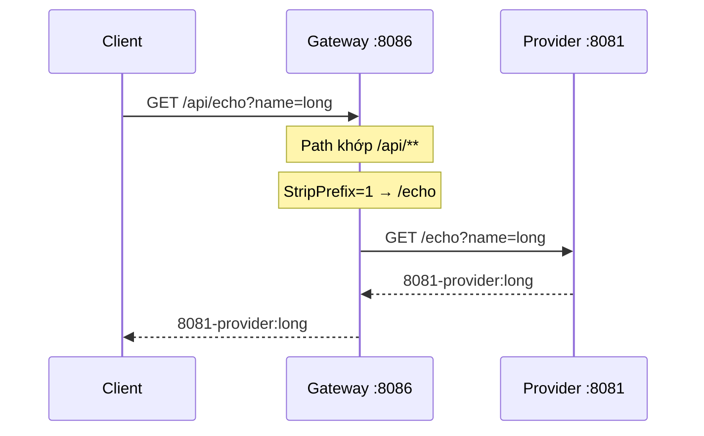
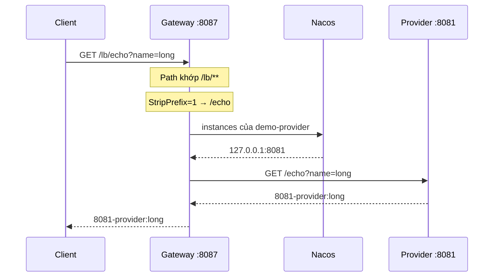
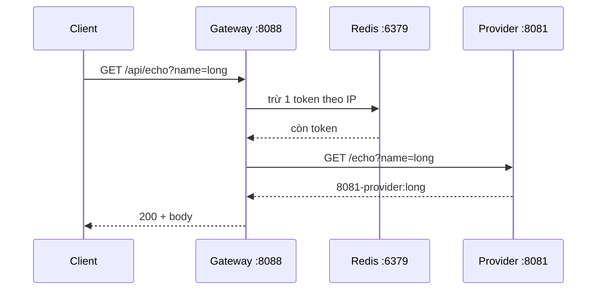
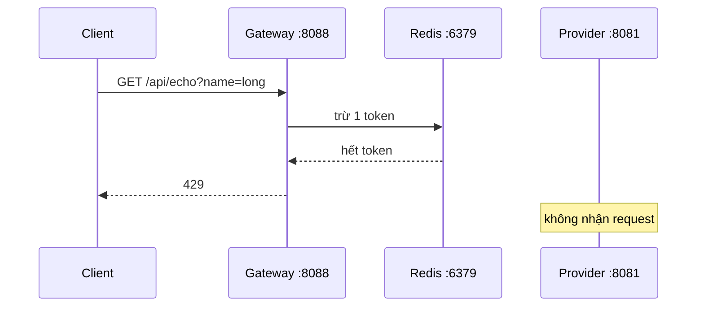

# Spring Cloud Gateway — Ghi chú học tập (labx-08)

> Cổng vào: client gọi Gateway; Gateway khớp route rồi forward backend.  
> Yudao: Boot **2.2** + Cloud **Hoxton** + `spring-cloud-starter-gateway` + `spring.cloud.gateway.routes`.  
> HDL: Java 21, Boot **3.5.14** + Cloud **2025.0.3** (Gateway **4.3.5**) + `spring-cloud-starter-gateway-server-webflux` + `spring.cloud.gateway.server.webflux.routes`.  
> Pha 3 — block **#9** (sau Nacos Config). Backend reuse `demo-provider` `:8081` (block #7) — **không** `user-service` yudao.

**Tiến độ:** 2026-08-26 — **3/3** bắt buộc (`static` + `registry` + `rate-limit` xong). Block **#9 xong**. Sentinel (#10) **đóng** (nacos; Feign skip) — [Spring Cloud Sentinel.md](../labx-04-spring-cloud-alibaba-sentinel/Spring%20Cloud%20Sentinel.md). **Pha 3 xong.**

---

## Mục lục

1. [Lab đứng đâu?](#1-lab-đứng-đâu)
2. [Kế hoạch submodule HDL](#2-kế-hoạch-submodule-hdl)
3. [BOM / dependency](#3-bom--dependency)
4. [Static](#4-static)
5. [Registry](#5-registry)
6. [Rate-limit](#6-rate-limit)
7. [Lệch API 2.x → 3.5](#7-lệch-api-2x--35)
8. [Việc còn lại](#8-việc-còn-lại)

---

## 1. Lab đứng đâu?

```text
Pha 3  #7 Discovery+Feign = service ở đâu, gọi theo tên
Pha 3  #8 Config          = config ngoài jar
Pha 3  #9 (lab này)       = cổng vào (route / filter)
Pha 3  #10 Sentinel       = limit / circuit
```

```text
Client
  →  gateway-static     :8086  Path=/api/**  → http://127.0.0.1:8081
  →  gateway-registry   :8087  Path=/lb/**   → lb://demo-provider (Nacos)
  →  gateway-rate-limit :8088  Path=/api/**  → :8081 + Redis token bucket
         ▼
  demo-provider :8081   /echo
  Redis                 :6379
```

Ba Gateway là **ba bài**, không nối thành một chuỗi hop. Client gọi **một** cổng. Backend gọi nhau bằng Feign (#7), **không** qua Gateway.

| Process | Host |
|---------|------|
| Nacos console / API | 18080 / 8848 / 9848 |
| Redis | **6379** |
| `demo-provider` | 8081 |
| gateway-static | **8086** |
| gateway-registry | **8087** |
| gateway-rate-limit | **8088** |

Gateway **WebFlux / Netty**. **Không** `spring-boot-starter-web` trên app Gateway (Tomcat vs Netty).

---

## 2. Kế hoạch submodule HDL

| # | Module | Trạng thái | Yudao | Học gì |
|---|--------|------------|-------|--------|
| 1 | `labx-08-sc-gateway-static` | ✅ | demo01 | `Path` + `StripPrefix` + URI HTTP tĩnh |
| 2 | `labx-08-sc-gateway-registry` | ✅ | demo02 + GlobalFilter | `lb://demo-provider` + Nacos + `loadbalancer` |
| 3 | `labx-08-sc-gateway-rate-limit` | ✅ | demo06 | `RequestRateLimiter` + Redis reactive + **429** |

**Bắt buộc:** 3 module. **Không** clone ~14 module yudao.

Skip lần đầu:

| Yudao | Lý do |
|--------|--------|
| user-service | Reuse `:8081` `/echo` |
| demo03 route trên Nacos/Apollo | Ý Config; yaml route đủ |
| demo04 Weight | Canary 90/10 URI khác — không phải `lb://` |
| demo05 Auth filter | Toy HashMap; không phải `lab-01` Security |
| demo07 Hystrix | Deprecated |
| demo07-sentinel | Block **#10** |
| demo08 Dubbo | Không stack HDL |
| demo09 / demo10 | Actuator / troubleshooting |

---

## 3. BOM / dependency

Boot parent **3.5.14** + import `spring-cloud-dependencies` **2025.0.3**. Gateway BOM **4.3.5**. **Không** `2025.1` (Boot 4).

| Module | Starter |
|--------|---------|
| static | **`spring-cloud-starter-gateway-server-webflux`** |
| registry | + `nacos-discovery` + `loadbalancer` |
| rate-limit | + `spring-boot-starter-data-redis-reactive` (pom **không** Nacos) |

Yaml Cloud 2025: `spring.cloud.gateway.server.webflux.routes` — không `spring.cloud.gateway.routes` Hoxton. [2025.0 notes](https://github.com/spring-cloud/spring-cloud-release/wiki/Spring-Cloud-2025.0-Release-Notes) · [configprops](https://docs.spring.io/spring-cloud-gateway/reference/configprops.html)

---

## 4. Static

Module này trả lời: **client có thể không biết port/path thật của provider**; họ gọi **một cổng Gateway**, Gateway **chọn backend bằng URI ghi cứng** rồi **sửa path** cho khớp API provider.

Không discovery, không `lb://`. Yaml ghi sẵn `http://127.0.0.1:8081`. (Provider HDL vẫn đăng ký Nacos lúc start — đó là code #7, **không** phải Gateway static query Nacos.)

Yudao demo01 forward ra `iocoder.cn`. HDL forward **provider local** để hai curl so được body.

### Route đang dùng

| Yaml | Việc trên request `GET /api/echo?name=long` |
|------|-----------------------------------------------|
| `Path=/api/**` | Chỉ nhận URL **bắt đầu `/api/`**. `/echo` trên cổng Gateway **không** vào route này. |
| `StripPrefix=1` | Path có các segment `api` + `echo`. Bỏ **1** segment đầu → còn `/echo`. Query `name=long` giữ nguyên. [StripPrefix 4.3](https://docs.spring.io/spring-cloud-gateway/reference/4.3/spring-cloud-gateway-server-webflux/gatewayfilter-factories/stripprefix-factory.html) |
| `uri: http://127.0.0.1:8081` | Sau khi sửa path, gọi **đúng máy/port đó** — không hỏi Nacos. |

Thiếu `StripPrefix`: provider nhận `/api/echo` → **404** (controller chỉ có `/echo`).

```text
path trên Gateway     / api / echo ?name=long
                         │
              StripPrefix=1 bỏ segment này
                         │
path tới provider     / echo ?name=long
```

### Luồng (curl qua Gateway)

```text
  trình duyệt / curl
           │
           │  GET http://127.0.0.1:8086/api/echo?name=long
           ▼
  ┌────────────────────────────────────────────┐
  │  gateway-static  :8086                     │
  │                                            │
  │  1. Path=/api/**     → khớp                │
  │  2. StripPrefix=1    → path = /echo        │
  │  3. uri tĩnh         → host 127.0.0.1:8081 │
  └────────────────────┬───────────────────────┘
                       │
                       │  GET http://127.0.0.1:8081/echo?name=long
                       ▼
  ┌────────────────────────────────────────────┐
  │  demo-provider  :8081                      │
  │  @GetMapping("/echo") → "8081-provider:long"│
  └────────────────────┬───────────────────────┘
                       │
                       │  cùng string, đi ngược về curl
                       ▼
                  8081-provider:long
```



Gọi **thẳng** provider (`GET :8081/echo?...`) **không** qua Gateway — cùng method trên controller, nên **cùng body**. Đó là cách kiểm: Gateway chỉ **đưa hộ**, không tự ghép `"8081-provider:long"`.

### Đã chạy (2026-08-25)

| Gọi | Đi đâu | Kết quả |
|-----|--------|---------|
| `GET :8081/echo?name=long` | Thẳng provider | `8081-provider:long` |
| `GET :8086/api/echo?name=long` | Gateway → sửa path → provider | `8081-provider:long` |
| `GET :8086/echo?name=long` | Gateway, **không** khớp `/api/**` | Không phải body trên — không vào route lab |

Hai dòng đầu trùng nhau = hop trên hình đã xảy ra. Module **không** chứng minh Nacos hay load balancer trên Gateway — đó là `registry`.

---


## 5. Registry

Module này trả lời: **URI trên Gateway ghi tên service**, không ghi `host:port`. Nacos trả **danh sách instance**; LoadBalancer **chọn một** rồi mới HTTP. Yaml lab **tự liệt kê** tên muốn mở (`demo-provider`). Không phải mỗi backend viết một file Gateway.

Gateway registry là **một process Spring Boot riêng** (`:8087`, `spring.application.name: gateway-registry`). Nó **thay** static, không đứng sau static.

| | `static` :8086 | `registry` :8087 (profile mặc định) |
|--|----------------|-------------------------------------|
| `uri` | `http://127.0.0.1:8081` | **`lb://demo-provider`** |
| Path lab | `/api/**` | **`/lb/**`** (hai Gateway chạy cùng lúc không lẫn prefix) |
| Nacos trên Gateway | Không | Có (`nacos-discovery` + `loadbalancer`) |
| Đổi port provider | Sửa yaml Gateway | Sửa đăng ký Nacos; yaml Gateway giữ nguyên tên |

[Load balancing `lb://`](https://docs.spring.io/spring-cloud-gateway/reference/4.3/spring-cloud-gateway-server-webflux/the-loadbalancer-filter.html) · yudao demo02 dùng `discovery.locator`; HDL **lab chạy** bằng route yaml tường minh (một tên). Locator nằm profile `prod` — xem dưới; **chưa curl**.

### Route đang dùng (`application.yml`, không `--spring.profiles.active`)

| Yaml | Việc trên request `GET /lb/echo?name=long` |
|------|---------------------------------------------|
| `Path=/lb/**` | Chỉ nhận URL **bắt đầu `/lb/`**. `/echo` trên cổng 8087 **không** vào route này. |
| `StripPrefix=1` | Bỏ segment `lb` → còn `/echo`. Query giữ nguyên. |
| `uri: lb://demo-provider` | Scheme `lb` = hỏi registry tên **`demo-provider`**, chọn instance, gọi HTTP tới instance đó. **Không** ghi `127.0.0.1:8081` trong route. |

Thiếu `StripPrefix`: provider nhận `/lb/echo` → **404**.

`discovery.ip: 127.0.0.1` trên yaml lab: Nacos client đăng ký IP loopback (máy dev). Không copy sang K8s.

`GlobalFilterConfig`: mọi request qua Gateway log `[gateway][pre] METHOD path` rồi `[gateway][post] status=…`. Không đổi routing.

```text
path trên Gateway     / lb / echo ?name=long
                         │
              StripPrefix=1 bỏ segment này
                         │
path tới provider     / echo ?name=long
                         │
              host/port lấy từ Nacos (tên demo-provider)
```

### Luồng (curl qua Gateway — đã chạy)

```text
  trình duyệt / curl
           │
           │  GET http://127.0.0.1:8087/lb/echo?name=long
           ▼
  ┌────────────────────────────────────────────┐
  │  gateway-registry  :8087                   │
  │                                            │
  │  1. Path=/lb/**      → khớp                │
  │  2. StripPrefix=1    → path = /echo        │
  │  3. lb://demo-provider                     │
  │     → Nacos: instance nào mang tên đó?     │
  │     → LoadBalancer chọn 1 (lab: :8081)     │
  └────────────────────┬───────────────────────┘
                       │
                       │  GET http://127.0.0.1:8081/echo?name=long
                       ▼
  ┌────────────────────────────────────────────┐
  │  demo-provider  :8081                      │
  │  @GetMapping("/echo") → "8081-provider:long"│
  └────────────────────┬───────────────────────┘
                       │
                       │  cùng string, đi ngược về curl
                       ▼
                  8081-provider:long
```



### Đã chạy (2026-08-25) — profile mặc định

| Gọi | Đi đâu | Kết quả |
|-----|--------|---------|
| `GET :8081/echo?name=long` | Thẳng provider | `8081-provider:long` |
| `GET :8087/lb/echo?name=long` | Gateway → Nacos tên `demo-provider` → sửa path → provider | `8081-provider:long` |

Hai dòng trùng body = hop trên hình đã xảy ra. Route **không** chứa `http://127.0.0.1:8081`. Module **không** chứng minh locator (mọi service trên Nacos thành route) và **không** chứng minh nhiều instance load-balance.

### `application-prod.yml` — locator, chưa curl

Profile `--spring.profiles.active=prod`. [DiscoveryClient Route Definition Locator](https://docs.spring.io/spring-cloud-gateway/reference/4.3/spring-cloud-gateway-server-webflux/the-discoveryclient-route-definition-locator.html): `discovery.locator.enabled` **mặc định tắt**. Bật thì Gateway gọi `DiscoveryClient.getServices()` và tạo route `/{serviceId}/**`. `url-expression: "'lb://' + serviceId"` là default docs.

File HDL:

- `routes: []` — khi bật `prod`, list yaml **thay** list trong `application.yml` (không để sót `/lb/**`). Locator **tự thêm** route `/{serviceId}/**`, không lấy từ list này. Không phải pattern prod bắt buộc.
- `include-expression: "serviceId != 'gateway-registry'"` — tránh tự proxy chính mình. Hardcode tên lab.
- Comment `metadata['edge']=='true'` — hướng siết hơn; **chưa bật**.
- Env `NACOS_*`; **không** `discovery.ip` (đúng hướng K8s hơn yaml lab).
- `trusted-proxies` comment — Cloud 2025, X-Forwarded mặc định tắt.

**Không** phải checklist production: locator đang mở **mọi** service Nacos trừ một tên; thiếu TLS, auth, timeout, rate limit, secret thật. Curl locator (chưa làm): `GET :8087/demo-provider/echo?name=long` khi profile `prod`.

---

## 6. Rate-limit

Module này trả lời: **cửa Gateway đếm request trước khi proxy**. Hết token → **429**, `demo-provider` **không** nhận HTTP. Redis giữ token bucket (docs: thuật toán Stripe). **Không** Redisson, **không** Bucket4j.

Gateway `:8088` **thay** static/registry, không đứng sau chúng. URI lab **giống static** (`http://127.0.0.1:8081`); việc mới là filter `RequestRateLimiter`.

| | Lab-11 `RRateLimiter` | Gateway `RequestRateLimiter` | Sentinel (#10) |
|--|------------------------|------------------------------|----------------|
| Chỗ | Trong JVM service | Cổng `:8088` | Rule Sentinel |
| Hết hạn | `tryAcquire() == false` | **HTTP 429** | Block/degrade |

[RequestRateLimiter 4.3](https://docs.spring.io/spring-cloud-gateway/reference/4.3/spring-cloud-gateway-server-webflux/gatewayfilter-factories/requestratelimiter-factory.html) bắt **`spring-boot-starter-data-redis-reactive`**. Yudao dùng `data-redis` + `spring.redis` — HDL: `spring.data.redis` Boot 3. Shortcut `RequestRateLimiter=1,2,…` docs ghi **invalid**; phải `name` + `args`.

### Route đang dùng (`application.yml`, không `--spring.profiles.active`)

| Yaml | Việc |
|------|------|
| `Path=/api/**` + `StripPrefix=1` + `uri: http://127.0.0.1:8081` | Giống static; path `/api/echo` → provider `/echo`. |
| `redis-rate-limiter.replenishRate: 1` | Mỗi giây đổ **1** token. |
| `redis-rate-limiter.burstCapacity: 2` | Bucket tối đa **2**. `requestedTokens` mặc định 1. |
| `key-resolver: "#{@ipKeyResolver}"` | SpEL → bean `RateLimiterConfig.ipKeyResolver`. Key = `getHostAddress()` (IP), không `getHostName()` yudao. `Mono.empty()` nếu không có remote — docs: key rỗng mặc định **từ chối**. |

Hai máy khác IP = **hai bucket**. Cùng IP (mọi curl localhost) = **một** hạn.

Không viết shortcut filter. Header mặc định (configprops `include-headers: true`): `X-RateLimit-Remaining`, `X-RateLimit-Burst-Capacity`, `X-RateLimit-Replenish-Rate`, `X-RateLimit-Requested-Tokens`.

```text
path trên Gateway     / api / echo ?name=long
                         │
              StripPrefix=1
                         │
              Redis: còn token theo IP?
                    │            │
                   có           hết
                    ▼            ▼
              GET :8081/echo    HTTP 429, không gọi provider
```

### Luồng — còn token (đã chạy)

```text
  curl  GET :8088/api/echo?name=long
           │
           ▼
  ┌──────────────────────────────────────────────┐
  │  gateway-rate-limit :8088                    │
  │  Path + StripPrefix → /echo                  │
  │  KeyResolver → IP; Redis trừ 1 token         │
  └────────────────────────┬─────────────────────┘
                           │  GET :8081/echo?name=long
                           ▼
                    200  8081-provider:long
```



### Luồng — hết token (đã chạy)



### Đã chạy (2026-08-26) — profile mặc định

Cần Redis `:6379` + `demo-provider` `:8081`. Ba curl **phải cùng một giây** (`burstCapacity: 2`). Sleep giữa các lần → bucket nạp, **không** 429.

| Gọi | Kết quả |
|-----|---------|
| `GET :8081/echo?name=long` | `8081-provider:long` — **không** qua limiter |
| `for i in 1 2 3; do curl -i :8088/api/echo?name=long; done` cùng giây `03:32:30` | lần 1–2 **200** + body; lần 3 **429**, `content-length: 0`, `X-RateLimit-Remaining: 0` |
| Ba curl dán tay `03:31:46` rồi `03:31:47` | **cả ba 200** — tràn giây, `replenishRate` đổ thêm token; Remaining lần cuối = 0 nhưng chưa có request thứ tư |
| `03:32:55` (~25s sau 429) | **200** lại — bucket đã nạp |

Gọi `:8088/echo` (không `/api`) **không** vào route lab.

JUnit (`WebTestClient` + Redis, lặp tới 429) **viết được** — sample Spring `rateLimiterWorks`. Lab HDL **không** thêm test class; chứng minh bằng curl.

### `application-prod.yml` trên đĩa — `default-filters` + **một** route tĩnh

Profile `--spring.profiles.active=prod`. [default-filters](https://docs.spring.io/spring-cloud-gateway/reference/spring-cloud-gateway-server-webflux/gatewayfilter-factories/default-filters.html) (Cloud 2025: `spring.cloud.gateway.server.webflux.default-filters`) áp **mọi** route. Limiter **một lần**, không copy `RequestRateLimiter` từng backend.

File **đang commit/đĩa** (pom **chỉ** gateway + redis-reactive, **không** Nacos):

- `default-filters` + `replenishRate`/`burstCapacity` env (mặc định **10** / **20** — curl ba phát **không** 429 như lab `1`/`2`).
- `routes:` **một** khối `/api/**` → `${PROVIDER_URI:http://127.0.0.1:8081}` + `StripPrefix`, **không** gắn limiter trên route (tránh chạy **hai** lần vì list prod **thay** list `application.yml`).
- Redis `spring.data.redis` + env. `trusted-proxies` comment (IP sau Nginx).

Đây **không** phải locator một trăm `lb://`. Locator cần `nacos-discovery` + `loadbalancer` rồi `routes: []` + `discovery.locator.enabled: true` (cùng ý registry `application-prod.yml`). Nội dung đó **đã đưa trong chat**, **chưa** dán vào pom/yaml trên đĩa. Curl locator `:8088/demo-provider/echo` **chưa** chạy.

**Không** checklist production: thiếu TLS, auth, secret Redis; `default-filters` + một URI tĩnh; locator (nếu bật) mở rộng Nacos.

Một trăm service **cùng hạn**: `default-filters` + locator (app đủ starter). Một trăm **QPS khác nhau**: thêm route yaml **chỉ** những path lệch, không copy một trăm khối giống nhau.

---

## 7. Lệch API 2.x → 3.5

| | Yudao 2.x | HDL 3.5 |
|--|-----------|---------|
| Cloud | Hoxton.SR1 | **2025.0.3** |
| Starter GW | `spring-cloud-starter-gateway` | **`spring-cloud-starter-gateway-server-webflux`** |
| Yaml route | `spring.cloud.gateway.routes` | **`spring.cloud.gateway.server.webflux.routes`** |
| Backend demo01 | `iocoder.cn` | **`http://127.0.0.1:8081`** |
| Registry demo02 | `discovery.locator` (mọi service) | Lab: yaml `lb://demo-provider`; locator chỉ profile `prod` (**chưa curl**) |
| Redis limiter | `data-redis` + `spring.redis` | **`data-redis-reactive`** + `spring.data.redis` ([docs](https://docs.spring.io/spring-cloud-gateway/reference/4.3/spring-cloud-gateway-server-webflux/gatewayfilter-factories/requestratelimiter-factory.html)) |

---

## 8. Việc còn lại

Block **#9 3/3 xong** (2026-08-26). Sentinel (#10) **đóng** (nacos; Feign skip) — [Spring Cloud Sentinel.md](../labx-04-spring-cloud-alibaba-sentinel/Spring%20Cloud%20Sentinel.md). Không nhầm limiter Redis trên Gateway với Sentinel. **Pha 3 xong.**

Chưa làm / không đếm xong #9: curl locator trên `:8088` (pom chưa Nacos); JUnit `WebTestClient`; Bucket4j; `trusted-proxies` thật.
